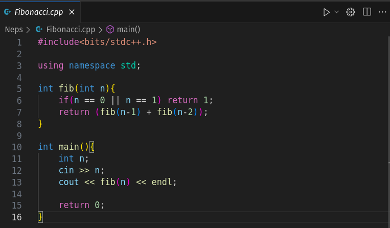

# Programação Competitiva

Programação Competitiva, também conhecida como CP (sigla de Competitive Programming), é uma área da programação que foca em grande parte em teorias e algoritimos.

A programação competitiva é um esporte mental (como por exemplo, o xadrez) onde os participantes precisam criar um programa de acordo com uma especificação, isto é, um programa que resolve um problema computacional.

## Linguagem de Programação

Uma linguagem de programação pode ser definida como um conjunto de regras, escritas respeitando uma determinada síntaxe, que permitem a formulação de um código, que então pode ser compilado ou interpretado, e finalmente executado.

As linguagens de programação intermediam nossa comunicação com o computador! Por isso, são muito importantes.

Uma linguagem muito comum, e recomendada por mim para se utilizar nos estudos de programação competitiva, é a linguagem C++ (cplusplus ou cpp).

* É muito rápida.

* Tem bibliotecas/funções muito úteis.

* "bits/stdc++" É a mais braba!

## IDE (Ambiente Integrado de Desenvolvimento)

O que é preciso para escrever um programa? Um bloco de notas pode servir. Porém, um bloco de notas pode não conter funções úteis durante o desenvolvimento do seu programa. É aqui que entra a IDE.

A IDE pode deixar a síntaxe destacada automaticamente (com uma cor para cada elemento, por exemplo), compilar seu código (tornar ele de um texto para um arquivo executável), sugerir funções, etc.

Recomendação: VS Code e Linux!

## Bibliotecas

