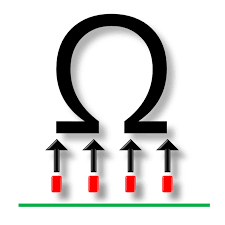

  

  
  
  

# competitive-programming

this repository aims to have solutions of some cp problems.

## About

the content is summarized in some online judges and regional contests:

* Codeforces
* Beecrowd
* Neps
* Kattis
* LeetCode
* HackerRank
* Contests Stuff

## License

This project is licensed under the [Unlicense](https://unlicense.org/) - see the [LICENSE](LICENSE) file for details.
